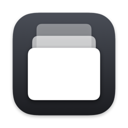
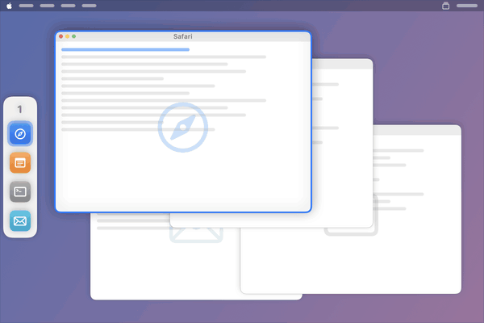
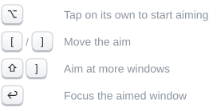
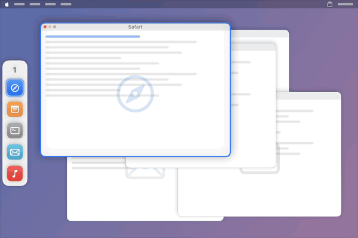
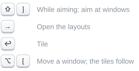
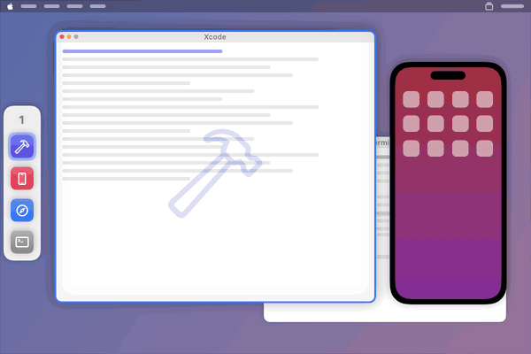
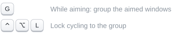
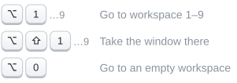
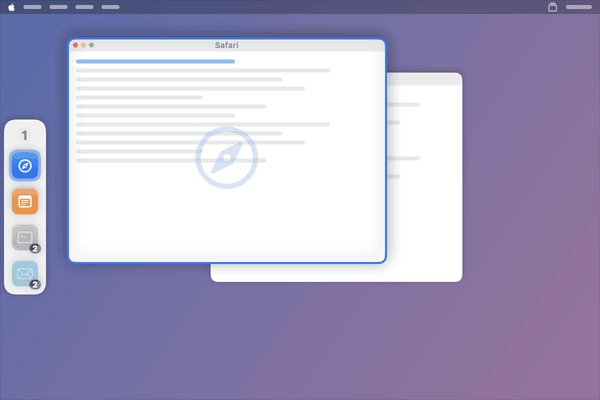
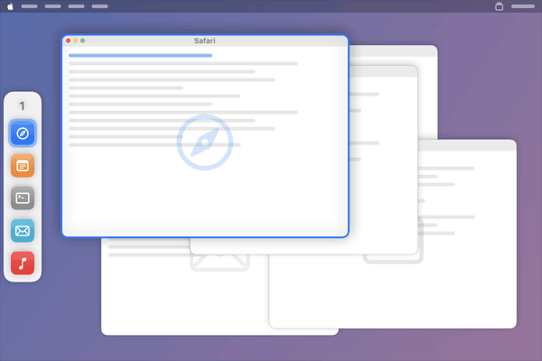

<h1 align="center">WindowQueue</h1>

<b>Every window on your Mac in one queue you drive from the keyboard.</b>

  <a href="https://github.com/mikolajpochec/wq/releases/latest"><b>Download</b></a> · macOS 14+ · Apple silicon and Intel · Free and open source

---

### One queue for every window
All your windows in one ordered list, shown in a strip on the side of the screen. Step through
it, and carry a window earlier or later.

### Aiming mode
Tap <kbd>⌥</kbd> on its own to aim at windows without focusing them. Add <kbd>⇧</kbd> to aim at
several, then act on all of them at once.

### Tiling that fits
Aim at windows and pick a layout. Fixed-shape windows like the iOS Simulator keep their
proportions, and reordering the queue lays the tiles out again.

### Groups
<kbd>G</kbd> in aiming mode bundles windows into one strip entry. Lock a group and cycling stays
inside it.

### Workspaces
Jump to a workspace by number, take the window along, or find an empty one.

### Window finder
Type part of a window's name and go straight there.

### Declutter
Every window in view at once, none on top of another, resized as little as possible.

### Drag to reorder
Drag an icon along the strip to move its window in the queue.

**And more:** maximize and fullscreen, multiple monitors, focus follows the mouse, window photos
and screen recording, a launcher shortcut, and every shortcut remappable. A welcome tour lets you
try it all on a pretend desktop.

---

## Install

1. Download the DMG from the [latest release](https://github.com/mikolajpochec/wq/releases/latest)
   and drag **WindowQueue** into **Applications**.
2. Open it. macOS blocks the first launch because the app isn't notarized: choose **Done**, then
   **System Settings › Privacy & Security › Open Anyway**.
3. Follow the tour, and allow **Accessibility** access when it asks.

Or build it yourself: `make install` (needs Xcode command line tools).

## More

- [Guide](docs/GUIDE.md): every feature and setting in detail
- [Specification](docs/SPECIFICATION.md): exact behaviour, for contributors
- [Changelog](CHANGELOG.md)

## License

[GNU GPL v3.0](LICENSE)
